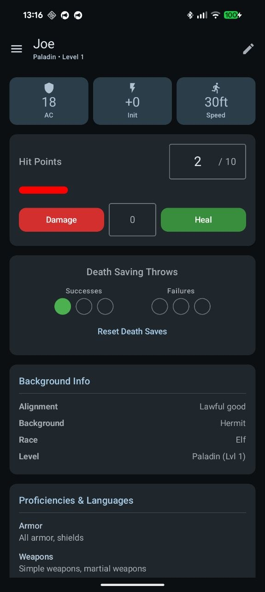
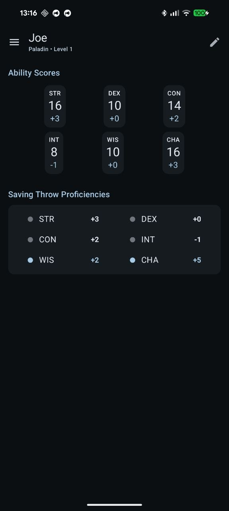
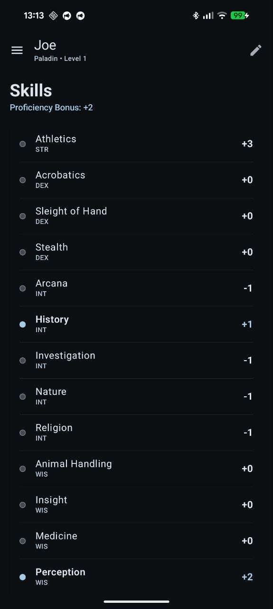

# 📝 Character Creator App

**Character Creator App** is a native Android application designed for tabletop RPG players (like D&D 5e) to streamline character creation and management. The app automates complex mechanics, including attribute-based skill calculations, level progressions, and equipment tracking, allowing players to focus on the story.

---

## Screenshots

| Dashboard | Character Stats | Skills & Logic |
| :---: | :---: | :---: |
|  |  |  |

---

## Key Features
* **Automated Calculations:** Real-time computation of modifiers, saving throws, and skill bonuses based on character attributes.
* **Character Management:** Create, store, and manage multiple character profiles with ease.
* **Modern UI/UX:** Fully declarative interface built with **Jetpack Compose**, featuring smooth **Lottie** animations and **Material 3** design.
* **Persistence:** All data is saved locally, ensuring offline access to your character sheets at any time.

## Tech Stack
The project follows modern Android development standards and best practices:

* **Language:** [Kotlin](https://kotlinlang.org/) (Coroutines, StateFlow, Kotlinx Serialization)
* **UI Framework:** [Jetpack Compose](https://developer.android.com/jetpack/compose) (Material Design 3)
* **Dependency Injection:** [Hilt](https://developer.android.com/training/dependency-injection/hilt-android)
* **Database:** [Room](https://developer.android.com/training/data-storage/room) (SQLite)
* **Networking:** [Retrofit 2](https://square.github.io/retrofit/) & OkHttp
* **Architecture:** **MVVM** + **Clean Architecture** (Data, Domain, and UI layers)
* **Libraries:** Lottie Animations, Accompanist (System UI Controller), Navigation Compose, KSP.

## Architecture
This project implements **Clean Architecture** principles to ensure scalability and maintainability:
* **Data Layer:** Handles Room database operations and API communication.
* **Domain Layer:** Contains pure business logic and Use Cases (e.g., `CalculateStatUseCase`).
* **UI Layer:** Utilizes ViewModels to expose state via **StateFlow** to the Compose UI.

## Installation
1. Clone the repository:
   ```bash
   git clone [https://github.com/mvoitovych/character-creator-app.git](https://github.com/mvoitovych/character-creator-app.git)
